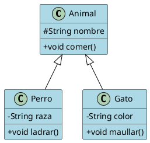
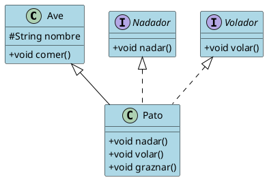

# Guía Completa de Herencia en Java

## Tabla de Contenidos
1. [Relación de Generalización](#1-relación-de-generalización)
2. [Concepto de Herencia](#2-concepto-de-herencia)
3. [Beneficios de la Herencia](#3-beneficios-de-la-herencia)
4. [Reconociendo la Herencia](#4-reconociendo-la-herencia)
5. [Superclases y Subclases](#5-superclases-y-subclases)
6. [Visibilidad Protegida](#6-visibilidad-protegida)
7. [Reglas de Herencia](#7-reglas-de-herencia)
8. [Herencia con Clases Concretas](#8-herencia-con-clases-concretas)
9. [Constructores en la Herencia](#9-constructores-en-la-herencia)
10. [Uso de this y super](#10-uso-de-this-y-super)
11. [Herencia Múltiple](#11-herencia-múltiple)
12. [Diagramas UML de Herencia](#12-diagramas-uml-de-herencia)

## 1. Relación de Generalización
La generalización es un concepto fundamental en programación orientada a objetos que permite identificar características comunes entre diferentes clases y agruparlas en una clase más general.

```java
class Animal {
    protected String nombre;
}

class Perro extends Animal {    // Perro es una especialización de Animal
    private String raza;
}
```

## 2. Concepto de Herencia
La herencia es un mecanismo que permite crear nuevas clases basadas en clases existentes, heredando sus atributos y métodos.

```java
class Vehiculo {
    protected String marca;
    
    public void arrancar() {
        System.out.println("Arrancando");
    }
}

class Coche extends Vehiculo {
    public void acelerar() {
        System.out.println("Acelerando");
    }
}
```

## 3. Beneficios de la Herencia
- Reutilización de código
- Extensibilidad
- Polimorfismo
- Mantenimiento más sencillo

```java
class FiguraGeometrica {
    public double calcularArea() {
        return 0.0;
    }
}

class Rectangulo extends FiguraGeometrica {
    private double base;
    private double altura;
    
    @Override
    public double calcularArea() {
        return base * altura;
    }
}

class Circulo extends FiguraGeometrica {
    private double radio;
    
    @Override
    public double calcularArea() {
        return Math.PI * radio * radio;
    }
}
```

## 4. Reconociendo la Herencia
Se puede identificar la herencia cuando existe una relación "es un" entre clases.

```java
class Animal {
    public void respirar() {
        System.out.println("Respirando");
    }
}

class Gato extends Animal {
    public void maullar() {
        System.out.println("Miau");
    }
}
```

## 5. Superclases y Subclases
- Superclase: clase padre o base
- Subclase: clase hija o derivada

```java
class Empleado {           // Superclase
    protected String nombre;
    protected double salario;
}

class Gerente extends Empleado {    // Subclase
    private String departamento;
}
```

## 6. Visibilidad Protegida
El modificador `protected` permite que los miembros sean accesibles desde las clases heredadas.

```java
class Persona {
    protected String nombre;    // Accesible en clases hijas
    private int edad;          // No accesible en clases hijas
}

class Estudiante extends Persona {
    public void mostrarNombre() {
        System.out.println(nombre);    // Puede acceder a nombre
        // System.out.println(edad);   // Error: no puede acceder a edad
    }
}
```

## 7. Reglas de Herencia
- Una clase solo puede heredar de una clase (herencia simple en Java)
- Todas las clases heredan implícitamente de Object
- No se heredan constructores
- Se pueden sobrescribir métodos usando @Override

```java
class Producto {
    @Override
    public String toString() {    // Sobrescribiendo método de Object
        return "Producto genérico";
    }
}
```

## 8. Herencia con Clases Concretas
Las clases concretas pueden ser heredadas y pueden crear instancias.

```java
class Instrumento {
    public void tocar() {
        System.out.println("Tocando instrumento");
    }
}

class Guitarra extends Instrumento {
    @Override
    public void tocar() {
        System.out.println("Tocando guitarra");
    }
}
```

## 9. Constructores en la Herencia
Los constructores de la clase padre deben ser llamados usando `super()`.

```java
class Animal {
    protected String nombre;
    
    public Animal(String nombre) {
        this.nombre = nombre;
    }
}

class Perro extends Animal {
    private String raza;
    
    public Perro(String nombre, String raza) {
        super(nombre);    // Llamada al constructor de Animal
        this.raza = raza;
    }
}
```

## 10. Uso de this y super
- `this`: referencia a la instancia actual
- `super`: referencia a la clase padre

```java
class Vehiculo {
    protected String marca;
    
    public void mostrarInfo() {
        System.out.println("Vehículo marca: " + marca);
    }
}

class Coche extends Vehiculo {
    private String modelo;
    
    public void mostrarInfo() {
        super.mostrarInfo();    // Llama al método de la clase padre
        System.out.println("Modelo: " + this.modelo);
    }
}
```

## 11. Herencia Múltiple
Java no permite herencia múltiple de clases, pero se puede lograr usando interfaces.

```java
interface Nadador {
    void nadar();
}

interface Volador {
    void volar();
}

class Ave {
    protected String nombre;
    
    public void comer() {
        System.out.println("El ave está comiendo");
    }
}

class Pato extends Ave implements Nadador, Volador {
    @Override
    public void nadar() {
        System.out.println("El pato está nadando");
    }
    
    @Override
    public void volar() {
        System.out.println("El pato está volando");
    }
}
```

## 12. Diagramas UML de Herencia

### Herencia Simple




### Herencia Múltiple con Interfaces




## Conclusión
La herencia es un pilar fundamental de la programación orientada a objetos en Java, permitiendo crear jerarquías de clases organizadas y reutilizables. Aunque Java no soporta herencia múltiple directamente, el uso de interfaces proporciona una alternativa flexible y segura para lograr funcionalidad similar.

## Referencias
- Oracle Java Documentation: [Inheritance](https://docs.oracle.com/javase/tutorial/java/IandI/subclasses.html)
- Java Language Specification: [Inheritance, Overriding, and Hiding](https://docs.oracle.com/javase/specs/jls/se17/html/jls-8.html#jls-8.4.8)
